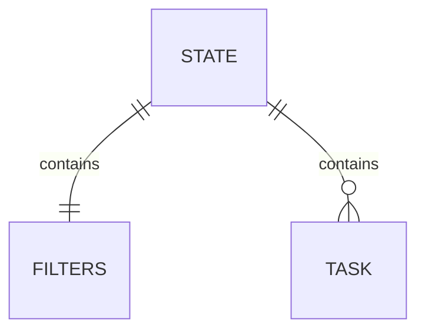

<!-- omit in toc -->

# ToDo App

This todo app is designed to be incredibly simple and user friendly, with a
focus on providing just the minimal functionality needed to help manage
their tasks effectively. Despite its simplicity, the app includes all the basic
features that users expect from a todo app, including the ability to create
tasks, set due dates and reminders, and mark tasks as completed.
The app's minimalist design and intuitive
interface make it easy to use, with no unnecessary clutter or distractions.

<!-- omit in toc -->
## Table of Contents

Table of Contents(up to date)
- [Todo App](#todo-app)
    - [Features](#features)
    - [Requirements](#requirements)
    - [Getting Started](#getting-started)
    - [User Stories](#user-stories)
## Features

- Simple and user friendly
- focus on minimal functionality
- ability to add, edit and complete tasks

## Requirements

- An IDE like [VSC](https://code.visualstudio.com)
- Basic [HTML, CSS and javascript](https://developer.mozilla.org/en-US/docs/Learn)  skills
- a browser like [chrome](https://google/chrome)

## Data


## Getting Started
```
Clone the repository (https://github.com/)
```
Run local host server
Open `index.html`.
